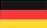

### Hi there 👋

<!--
# Projects

## September 2022 - Present:

- **Website with travel packages:**
  | HTML, CSS, JavaScript, MySQL, PHP.
  - Designed and built a full-stack travel package website, implementing security measures against XSS, \
    password hashing, server and client-side validation during login.

- **EShop testing:**
  | Java, ACTS, PCTgen.
  - Performed Selenium-based website testing.

- **Role-playing game 2D game:**
  | Java, Swing, Maven.
  - Developed a 2D role-playing game.
  - Implemented enemy characters with multi-threaded programming, including animations, actions,\
and AI behavior such as walking, attacking, and pursuing the main hero.

- **Database Application:**
  | Java Spring, PostgreSQL.
  - Created a CRUD system for Travel Agency.

- **Project of a mobile bank:**
  | Enterprise Architect.
  - Produced documentation for a mobile bank project using Business Domain Model,\
    Business Process, Deployment, UML, and Use Case diagrams.
-->

# Social

# Skills

<!--
# Languages
 &nbsp; \
 &nbsp; \
 &nbsp; \
 &nbsp; 
-->

# CV
[**Look at CV**](https://mathewtroy.github.io/react_cv/)

<!--
**mathewtroy/mathewtroy** is a ✨ _special_ ✨ repository because its `README.md` (this file) appears on your GitHub profile.

Here are some ideas to get you started:

- 🔭 I’m currently working on ...
- 🌱 I’m currently learning ...
- 👯 I’m looking to collaborate on ...
- 🤔 I’m looking for help with ...
- 💬 Ask me about ...
- 📫 How to reach me: ...
- 😄 Pronouns: ...
- ⚡ Fun fact: ...
-->

